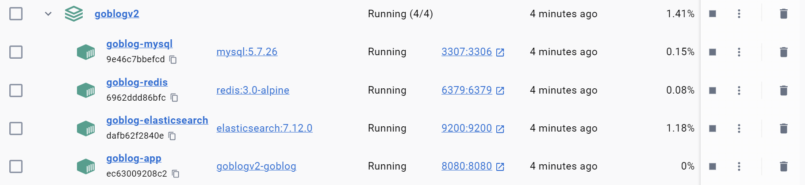

# GO BLOG 🚀
---

**一个高性能、易扩展的Go语言博客系统**


### 环境要求

| 组件  | 最低版本 | 推荐版本 |
| :---- | :------- | :------- |
| Go    | 1.20     | 1.22     |
| MySQL | 5.7      | 8.0      |
| Redis | 3.05     | 7.2      |

---

## 🌟 项目简介

基于现代Web技术栈构建的博客系统，支持快速部署和高并发场景。提供以下核心能力：

- RESTful API接口规范
- 前后端分离架构
- 容器化部署方案
- 自动化CI/CD支持

---

## 🛠️ 技术栈

| 类别         | 技术选型                      |
| ------------ | ----------------------------- |
| **Web框架**  | Gin + GORM + Gorilla          |
| **数据库**   | MySQL + Redis + Elasticsearch |
| **协议支持** | HTTP/HTTPS/WebSocket          |
| **缓存策略** | Redis热点数据缓存             |
| **搜索引擎** | Elasticsearch全文检索         |
| **项目管理** | Go Modules                    |
| **部署方案** | Docker Compose                |

---

## 🎯 核心特性

### 高性能架构

- 基于Gin框架的高效路由处理
- Redis缓存层减少数据库IO压力
- 连接池优化数据库访问

### 智能搜索

- Elasticsearch实现文章全文检索
- 支持多字段联合查询

### 安全防护

- JWT Token身份验证
- SQL注入防护
- XSS攻击防范

### 扩展能力

- 模块化设计
- 清晰的MVC分层结构
- 插件机制支持功能扩展
- 完善的接口文档

---

## 📂 项目结构

````bash
├───config              # 配置文件目录，用于存放项目的各种配置信息
├───controller          # 控制器目录，处理业务逻辑和请求响应
│   ├───api             # API 控制器子目录，处理具体的 API 请求
│   ├───req             # 请求相关的DTO
│   ├───res             # gin响应相关的处理代码目录
│   └───resp            # 响应相关的DTO
├───core                # 核心组件加载目录
├───doc                 # 文档目录，存放项目相关的文档
├───dump                # 数据转储目录，用于存放数据备份等
├───flags               # 命令行标志相关的代码目录
├───global              # 全局变量和配置相关的代码目录
├───middleware          # 中间件目录，存放项目的中间件代码
├───models              # 模型目录，存放数据模型相关的代码
│   ├───diverseType     # 多样化类型的模型子目录
│   ├───esmodels        # Elasticsearch 模型子目录
│   └───sqlmodels       # SQL 模型子目录
├───plugins             # 插件目录，存放项目的插件代码
├───repository          # 仓库层目录，负责数据的持久化和读取
├───router              # 路由目录，负责请求的路由分发
├───service             # 服务层目录，处理业务逻辑
├───tmp                 # 临时文件目录，用于存放临时数据
├───uploads             # 上传文件目录，用于存放用户上传的文件
├───utils               # 工具函数目录，存放通用的工具函数
│   go.mod              # Go 模块文件，记录项目的依赖信息
│   go.sum              # Go 模块的校验和文件，确保依赖的完整性
│   main.go             # 项目的入口文件
│   makefile            # Makefile 文件，用于自动化构建和管理项目
│   README.md           # 项目的说明文档
│   settings.yaml       # 项目的配置文件，使用 YAML 格式
````

---

## 🚀 快速开始 

### 环境要求

| 组件          | 最低版本 |
| ------------- | -------- |
| Go            | 1.20+    |
| MySQL         | 5.7+     |
| Redis         | 3.05+    |
| Elasticsearch | 7.12+    |

### 安装步骤

1. 安装对应环境

2. 配置相关设置 `settings.yaml`

3. 安装依赖：

   ```bash
   go mod tidy
   go run main.go -createdb
   go run main.go -escreate
   go run  mian.go -avatar
   go run main.go
   ```

---

## 🐳 Docker 部署指南



### 环境准备

1. 安装基础组件：

   ```bash
   # Docker & Docker Compose
   curl -fsSL https://get.docker.com | bash -s docker
   sudo systemctl enable --now docker
   sudo curl -L "https://github.com/docker/compose/releases/download/v2.23.0/docker-compose-$(uname -s)-$(uname -m)" -o /usr/local/bin/docker-compose
   sudo chmod +x /usr/local/bin/docker-compose
   ```

2. 创建初始化文件：

   ```bash
   mkdir -p backend/docker_init && cat > backend/docker_init/mysql-init.sql <<EOF
   CREATE DATABASE IF NOT EXISTS yu_blog CHARACTER SET utf8mb4 COLLATE utf8mb4_unicode_ci;
   EOF
   ```

### 修改配置

```
# 使用docker deploy项目 需要修改host 
#  本地部署使用127.0.0.1就行
mysql:
    host: mysql
    port: 3307 #避免与本地冲突
    config: charset=utf8mb4&parseTime=True&loc=Local
    db: yu_blog
    user: root
    password: "123456"
    log_level: debug
redis:
    ip: redis
    port: 6379
    password: ""
    pool_size: 100
es:
    host: http://elasticsearch
    port: 9200
    user: ""
    password: ""

```

### 快速启动

```bash
# 一键部署
docker-compose up -d --build

# 查看服务状态
docker-compose ps
```

### 服务访问

| 服务          | 访问地址                                        | 默认账号                             |
| :------------ | :---------------------------------------------- | :----------------------------------- |
| 博客应用      | [http://localhost:8080](http://localhost:8080/) | 自己使用接口创建 权限role=1 为管理员 |
| MySQL数据库   | localhost:3307                                  | root/123456                          |
| Redis         | localhost:6379                                  | -                                    |
| Elasticsearch | [http://localhost:9200](http://localhost:9200/) | -                                    |

### 数据持久化

```bash
.
├── data
│   ├── elasticsearch    # 搜索索引数据
│   ├── mysql            # 数据库文件
│   └── redis           # 缓存数据
└── uploads             # 用户上传文件
```

---

## 📚 文档资源

| 资源类型   | 访问地址                              |
| :--------- |:----------------------------------|
| API文档    | [在线文档](doc/goblog_v2.md)          |
| 架构设计图 | [UML图表](doc/sql/uml.png)  |

## 🤝 参与贡献

欢迎通过Issue和PR参与项目改进，请遵循以下流程：

1. Fork项目仓库
2. 创建特性分支（`git checkout -b feature/awesome-feature`）
3. 提交修改（`git commit -m 'Add some feature'`）
4. 推送分支（`git push origin feature/awesome-feature`）
5. 创建Pull Request

---

## 📄 许可证

本项目采用 [MIT License](LICENSE.txt)

---

**让技术写作更简单** ✍️ | **为开发者打造的博客平台** 💻


