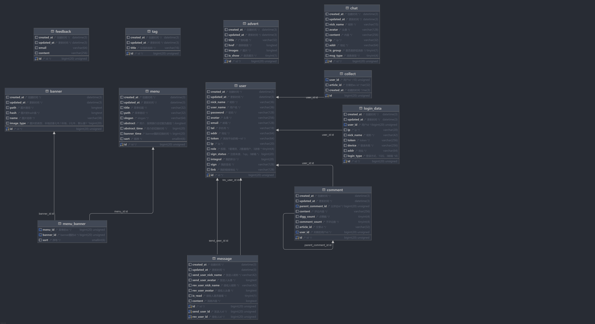

# GO BLOG 🚀

**一个易扩展的Go语言博客系统**


## 🌟 项目简介

一个基于现代Web技术栈构建的博客系统，支持快速部署和高并发场景。后端核心使用Go语言开发，提供RESTful API接口，前后端分离设计。

## 🛠️ 技术栈

| 类别         | 技术选型                      |
| ------------ | ----------------------------- |
| **Web框架**  | Gin + GORM                    |
| **数据库**   | MySQL + Redis + Elasticsearch |
| **协议支持** | HTTP/HTTPS/WebSocket          |
| **缓存策略** | Redis热点数据缓存             |
| **搜索引擎** | Elasticsearch全文检索         |
| **项目管理** | Go Modules                    |

## 🎯 核心特性

### 高性能架构

- 基于Gin框架的高效路由处理
- Redis缓存层减少数据库IO压力
- 连接池优化数据库访问

### 智能搜索

- Elasticsearch实现文章全文检索
- 支持多字段联合查询

### 安全防护

- JWT Token身份验证
- 请求频率限制
- SQL注入防护
- XSS攻击防范

### 扩展能力

- 模块化设计
- 清晰的MVC分层结构
- 插件机制支持功能扩展
- 完善的接口文档

## 📂 项目结构

```bash
├───config              # 配置文件目录，用于存放项目的各种配置信息
├───controller          # 控制器目录，处理业务逻辑和请求响应
│   ├───api             # API 控制器子目录，处理具体的 API 请求
│   ├───req             # 请求相关的DTO
│   ├───res             # gin响应相关的处理代码目录
│   └───resp            # 响应相关的DTO
├───core                # 核心组件加载目录
├───doc                 # 文档目录，存放项目相关的文档
├───dump                # 数据转储目录，用于存放数据备份等
├───flags               # 命令行标志相关的代码目录
├───global              # 全局变量和配置相关的代码目录
├───middleware          # 中间件目录，存放项目的中间件代码
├───models              # 模型目录，存放数据模型相关的代码
│   ├───diverseType     # 多样化类型的模型子目录
│   ├───esmodels        # Elasticsearch 模型子目录
│   └───sqlmodels       # SQL 模型子目录
├───plugins             # 插件目录，存放项目的插件代码
├───repository          # 仓库层目录，负责数据的持久化和读取
├───router              # 路由目录，负责请求的路由分发
├───service             # 服务层目录，处理业务逻辑
├───tmp                 # 临时文件目录，用于存放临时数据
├───uploads             # 上传文件目录，用于存放用户上传的文件
├───utils               # 工具函数目录，存放通用的工具函数
│   .gitignore          # Git 忽略文件，指定不需要纳入版本控制的文件和目录
│   go.mod              # Go 模块文件，记录项目的依赖信息
│   go.sum              # Go 模块的校验和文件，确保依赖的完整性
│   LICENSE.txt         # 项目的许可证文件
│   main.go             # 项目的入口文件
│   makefile            # Makefile 文件，用于自动化构建和管理项目
│   README.md           # 项目的说明文档
│   settings.yaml       # 项目的配置文件，使用 YAML 格式
```

## 🚀 快速开始

### 环境要求

| 组件          | 最低版本 |
| ------------- | -------- |
| Go            | 1.20+    |
| MySQL         | 5.7+     |
| Redis         | 3.05+    |
| Elasticsearch | 7.12+    |

### 安装步骤

1. 安装对应环境,可以使用docker phpstudy 以及本地环境

2. 配置相关设置 `settings.yaml`

3. 安装依赖：

   ```bash
   go mod tidy
   go run main.go
   ```

   

## 📚 接口文档

[](doc/goblog_v2.md)

## 📊 系统架构



## 🤝 参与贡献

欢迎通过Issue和PR参与项目改进，请遵循以下流程：

1. Fork项目仓库
2. 创建特性分支（`git checkout -b feature/awesome-feature`）
3. 提交修改（`git commit -m 'Add some feature'`）
4. 推送分支（`git push origin feature/awesome-feature`）
5. 创建Pull Request

## 📄 许可证

本项目采用 [MIT License](LICENSE.txt)

---

**让技术写作更简单** ✍️ | **为开发者打造的博客平台** 💻

